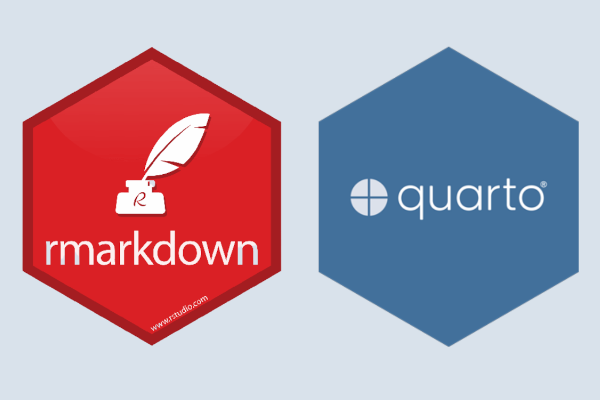

# Quarto/Rmarkdown 

### **Create a dashboard with R using Quarto**

> You must have a RStudio v2022.07.1 or a later version to render this prohject.
> To upgrade Quarto out of sync with the bundled version in RStudio, follow the directions at https://quarto.org/docs/download/

### About the Dataset

In this case our data coming from two different datasets:  
1. **Items**: this dataset is composed by 792 observations and 9 columns;  
2. **Reviews**: this dataset is composed by 82815 observations and 8 columns;  

Inside this two dataset there is the column *asin* that is and identify unique column. 
It's important to merge our two dataset in one.  
Merging data we obtain one dataset composed by 82815 observations and 16 columns.  
We will select some columns to create the dashboard.

These are the columns:

| Column name | Description                                                                      
|-----------------------------|-------------------------------------------|
| **Asin**  | Unique ID 
| **Brand** | Brand Device
| **Rating**| Average device rate
| **Title** | Device Name
| **Total Reviews** | Total of reviews about that device
| **Prices**| Device price
| **Date**  | Date reviews
| **Body**  | Content review
| **Name**  | Name of person who wrote the review

### Conclusion

This is my personal dashboard to get informations from this dataset. You can clone this repo and do what you want.

**ENJOY!**
